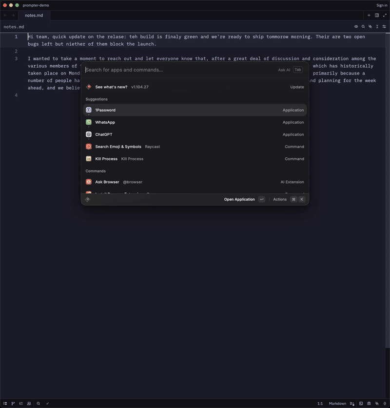
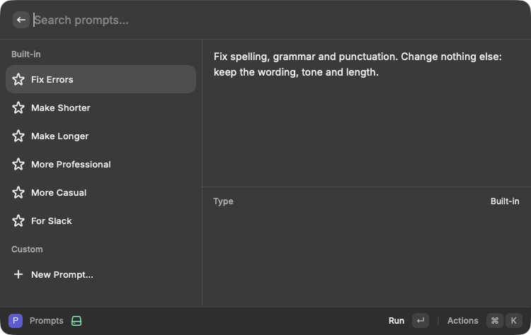
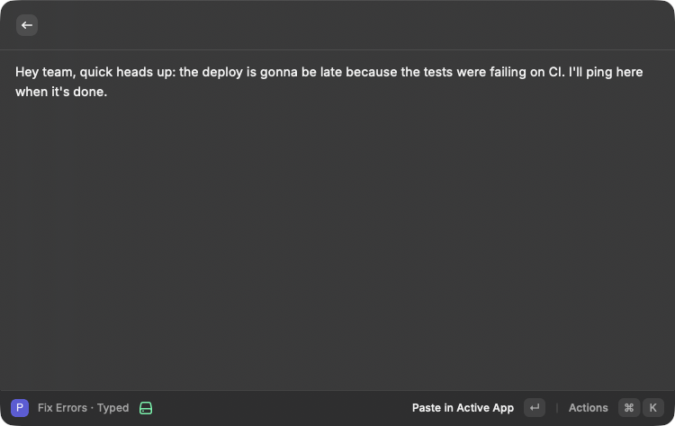

# Prompter



Fix Errors in preview mode with the copy toast and Enter to paste, then Make Shorter with Output set
to paste. [Full-quality video](docs/demo.mp4).

A [Raycast](https://raycast.com) extension that rewrites text with an LLM, using your own API key.
Six prompts ship as commands, so each can have a hotkey: **Fix Errors**, **Make Shorter**,
**Make Longer**, **More Professional**, **More Casual**, **For Slack**. Edit them, add your own,
and change the rules every prompt shares.





## Install

Not on the Raycast Store. Clone and build it into Raycast:

```sh
git clone https://github.com/ivorpad/raycast-prompter.git
cd raycast-prompter
bun install        # or npm install
bun run build      # `ray build`: installs the extension into Raycast
```

Requires Raycast 1.104 or later and Node 22 or later (Bun runs the scripts but `ray` itself is a Node CLI).

## Setup

The first command you run asks for a **Provider** and an **API Key**:

| Provider | Base URL | Notes |
| --- | --- | --- |
| OpenAI | default | |
| OpenRouter | default | model list shows OpenRouter's display names |
| Anthropic | default | Messages API, `max_tokens` 4096 |
| Other OpenAI-compatible | required | Groq, Mistral, Ollama (`http://localhost:11434/v1`), LM Studio… |

Then pick a model. Run **Select Model**, or press Enter on the "No model selected" screen any prompt
shows until you do. The list is fetched from the provider's `/models` endpoint, nothing is hard-coded,
and the choice is remembered per provider.

A key pasted under the wrong provider (an OpenRouter `sk-or-…` key with OpenAI selected) is caught
with a message instead of a 401.

## Use

Select text in any app and run a prompt command. Input priority:

1. text typed after the command in Raycast (optional argument),
2. the selection in the frontmost app,
3. the clipboard.

The title bar shows which one was used, e.g. "Fix Errors · Clipboard".

**Output** preference:

- **Preview** (default): the result is rendered as markdown, line breaks kept, and copied to the
  clipboard on arrival (a checkbox turns that off). Paste and copy use the raw text. `↵` pastes over the selection, `⌘↵` copies,
  `⌘R` retries, `⌘⇧M` changes model, `⌘I` shows model, source and word counts.
- **Paste**: pasted over the selection as soon as it arrives; Raycast closes.
- **Copy**: copied to the clipboard; Raycast closes.

Esc while waiting cancels the request. If the model hits its output limit the HUD or a toast says so.

## Your own prompts

The **Prompts** command lists built-in and custom prompts with the full instruction in a side panel.

| Key | Action |
| --- | --- |
| `↵` | Run on the current selection or clipboard |
| `⌘E` | Edit (built-ins: the instruction only; the command keeps its name) |
| `⌘D` | Duplicate, e.g. to make a variant of a built-in |
| `⌘⇧A` | Add to Root Search: a Quicklink for a custom prompt |
| `⌘N` | New prompt |
| `⌃X` | Delete a custom prompt |
| `⌘⇧R` | Edit the shared rules sent before every task |

Edited built-ins show an "Edited" tag and a **Reset to Default** action.

Raycast commands are fixed in the manifest, so a custom prompt can't become a command. What it can be
is a Quicklink: an entry in root search under the prompt's name, with an alias and a hotkey if you
want them. Saving a new prompt lands on a screen whose first action, **Add to Root Search**, opens
Raycast's Create Quicklink form pre-filled; Enter there and the prompt is in root search. The same
action is on every custom prompt in the list (`⌘⇧A`). Deleting a prompt does not delete its Quicklink.

Typing `prompts <name>` in Raycast also runs a prompt by name.

Prompts and rules live in the extension's LocalStorage. Nothing is sent anywhere except to the
provider you configured.

## How a request looks

```
<shared rules>

Task: <the prompt's instruction>
```

goes in as the system prompt, the text as the user message. No temperature is set, so reasoning
models accept it.

## Develop

```sh
bun run dev        # ray develop: hot-reloads into Raycast
bun run lint       # ray lint: ESLint + Prettier + manifest checks
bun run fix-lint
```

```
src/
  builtin-prompts.ts  the six prompts, the default shared rules, systemPrompt()
  prompt-store.ts     usePrompts(): built-ins + edits + custom prompts + rules; findPrompt()
  prompts.tsx         Prompts command: browse, or run by name (Quicklink target)
  prompts-list.tsx    list UI with run/edit/duplicate/delete/reset/quicklink actions
  prompt-form.tsx     PromptForm and RulesForm
  llm/                Provider interface; openai.ts, anthropic.ts; index.ts maps preferences to a provider
  model.ts            useModel(): chosen model id, keyed by provider
  model-list.tsx      models from /models, cached per provider
  input.ts            typed argument → selection → clipboard
  markdown.ts         asMarkdown(): keep line breaks; Raycast ignores backslash escapes, so no escaping
  quicklink.ts        deeplink and Quicklink for a prompt (root-search entry)
  transform.tsx       shared view: input → complete() → preview / paste / copy
  select-model.tsx    Select Model command
  <prompt-id>.tsx     one entry per built-in prompt command
```

## License

[MIT](LICENSE)
